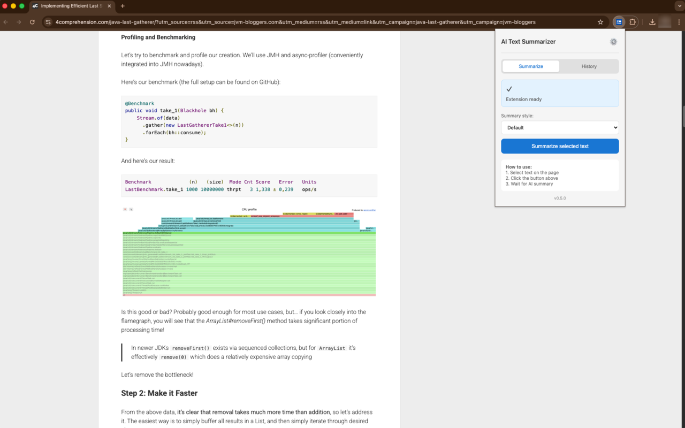
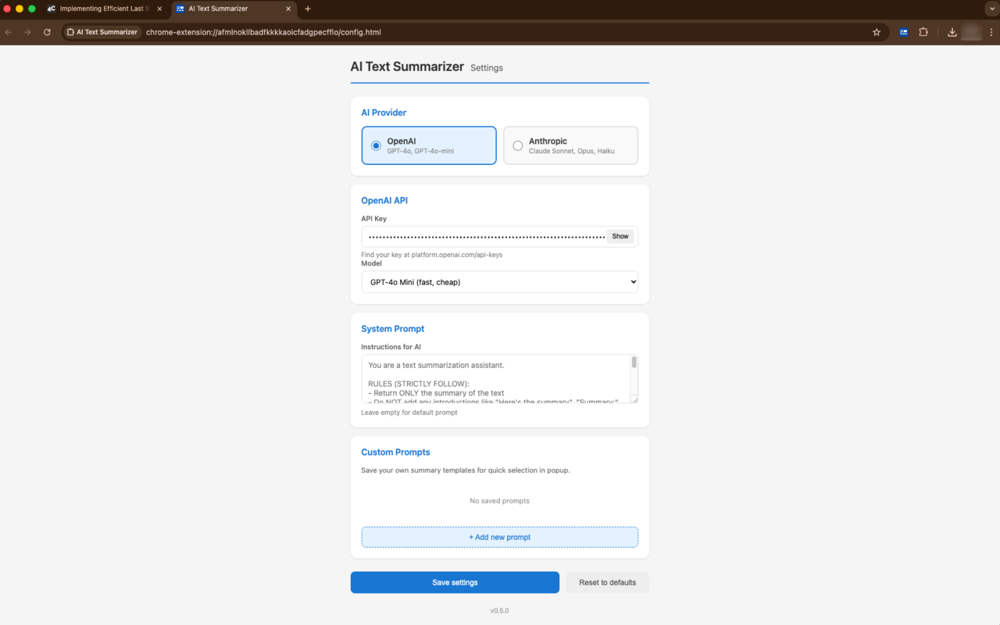
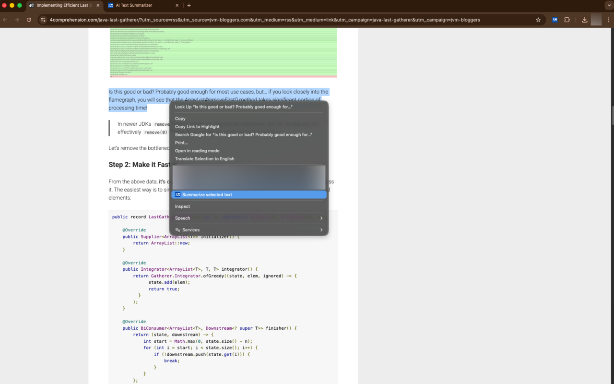
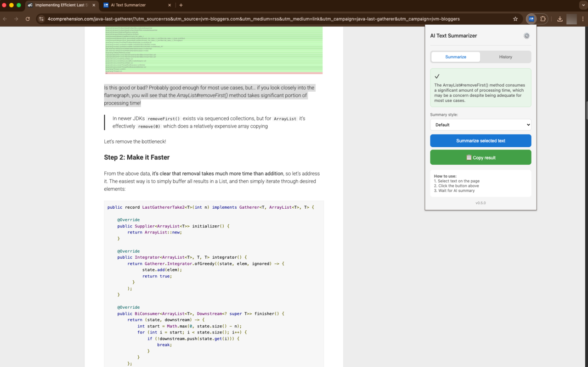
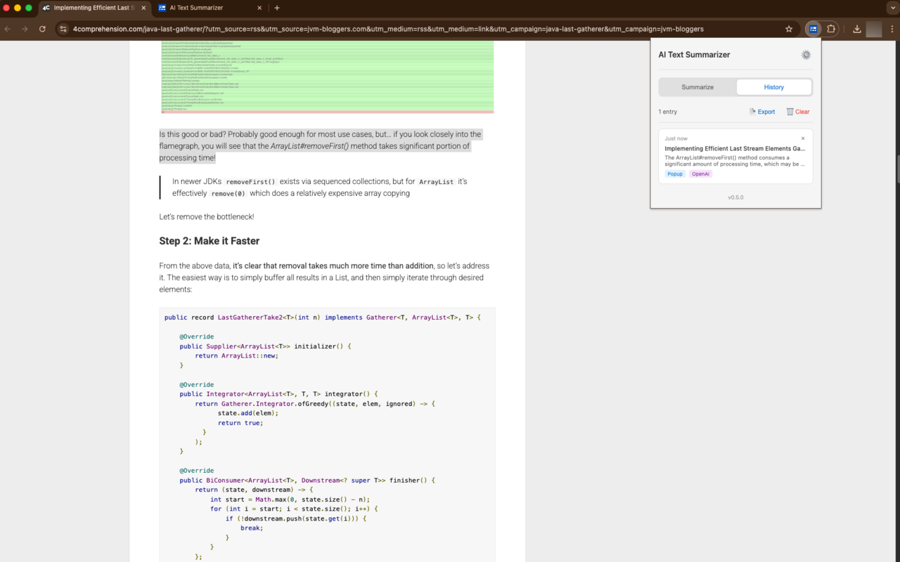

  

<h1 align="center">AI Text Summarizer</h1>

  <strong>Summarize any text on the web with one click using AI</strong>

  <a href="#features">Features</a> •
  <a href="#how-it-works">How It Works</a> •
  <a href="#screenshots">Screenshots</a> •
  <a href="#privacy">Privacy</a>

---

## Why AI Text Summarizer?

Reading long articles, documentation, or reports takes time. **AI Text Summarizer** helps you get the key points instantly. Select any text or summarize an entire page — powered by your choice of OpenAI (GPT-4o) or Anthropic (Claude).

**Your API key, your control.** No middleman, no subscriptions, no hidden costs. You pay only for what you use directly to AI providers.

---

## Features

**Multiple ways to summarize**
- Click the extension icon and hit "Summarize"
- Right-click on selected text and choose "Summarize selected text"
- Use keyboard shortcut (Ctrl+Shift+S / Cmd+Shift+S)

**Choose your AI**
- OpenAI (GPT-4o, GPT-4o Mini)
- Anthropic (Claude Sonnet, Opus, Haiku)

**Custom prompts**
- Create your own summary templates
- Adjust the AI instructions to your needs
- Save multiple prompts for different use cases

**Summary history**
- All your summaries are saved locally
- Export to Markdown for your notes
- Clear anytime

**Works in your language**
- English and Polish interface
- Summaries in any language you configure

---

## How It Works

1. **Select text** on any webpage (or leave empty to summarize the whole page)
2. **Click the extension** icon or use right-click menu
3. **Get your summary** in seconds
4. **Copy or save** the result

That's it. No account needed, no sign-up required.

---

## Screenshots

### Main Interface
Click the extension to see your options. One button to summarize.

### Settings
Choose your AI provider, model, and customize prompts.

### Right-Click Menu
Select text, right-click, and summarize instantly.

### Summary Result
Get concise summaries with one-click copy.

### History
Browse and export your past summaries.

---

## Privacy

**Your data stays with you.**

- All settings and history stored locally on your device
- Text is sent only to the AI provider you choose (OpenAI or Anthropic)
- No tracking, no analytics, no data collection
- We don't have servers — there's nowhere for your data to go

Read our full [Privacy Policy](privacy-policy.html).

---

## Requirements

- Google Chrome browser
- API key from [OpenAI](https://platform.openai.com/api-keys) or [Anthropic](https://console.anthropic.com/)

---

## Installation

1. Install from [Chrome Web Store](#) *(link coming soon)*
2. Click the extension icon
3. Go to Settings and enter your API key
4. Start summarizing!

---

## Feedback & Support

Found a bug or have a suggestion? [Open an issue](https://github.com/cezarysanecki/ai-text-summarizer/issues) on GitHub.

---

  Made with ❤️ for people who value their time

